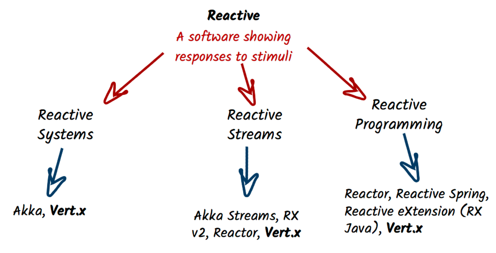

## What's Vert.x

We will attempt to explain Vert.x in just a few lines. As written on the Vert.x [web site](http://vertx.io), Vert.x is "a toolkit for building reactive applications on the JVM". 

There are a two equally important points in this description: toolkit and reactive.

Firstly, Vert.x is a toolkit. Meaning, Vert.x is not an application server, a container nor a framework. Vert.x is a plain old jar file, so a Vert.x application is an application that uses this jar file. Vert.x does not define a packaging model, all Vert.x components are plain boring jar files. How does this impact you and your application? Let’s imagine you are using a build tool such as Maven or Gradle, to make your application a Vert.x application just add the `vertx-core` dependency. Wanna use another Vert.x components, just add it as a dependency. It’s simple, burden-less. Starting the application is a simple class with the `public static void main(String[] args)` entry point. No specific IDE or plugin to install to start using Vert.x.

Then, Vert.x is reactive. Don't be confused by _Reactive_. They are many _Reactive_ things Today. Vert.x covers the 
whole reactive spectrum:

* reactive system - an architectural style to build responsive distributed system
* reactive streams - an API to process streams using an asynchronous non-blocking back-pressure
* reactive programming - APIs to implement asynchronous and event-driven program based on data flows

To handle these three reactive facets, Vert.x is event-driven and also non-blocking. Events are delivered in an _event loop_ that must **never** be blocked. We will see then event loop in action in this tutorial.

Vert.x lets you implement distributed applications, either by using the built-in TCP and HTTP server and client, but also using the Vert.x event bus, a lightweight mechanism to send and receive messages. The Vert.x ecosystem also provides modules for AMQP, RabbitMQ, MQTT... More importantly, with Vert.x your are **back in charge**, no need to follow obscure framework rules. Vert.x is all about freedom!