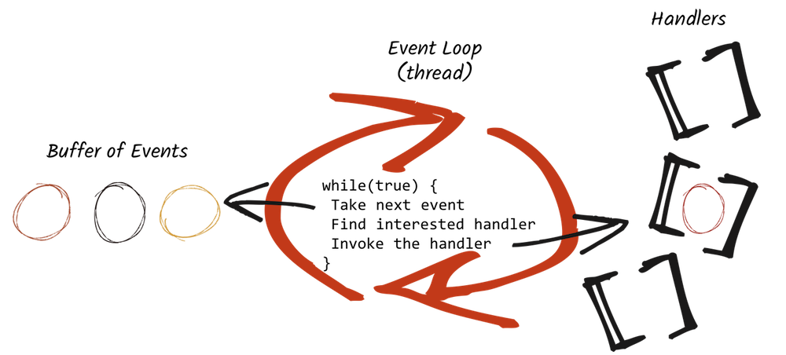

## Observing the event loop

Things are going to be a bit more interesting now... Let's modify our code to print in the JSON response the name of the thread handling the request and the current date:

@[Observing the event loop]({"stubs": ["src/main/java/io/vertx/playground/HttpServerEventLoopExample.java"], "command": "io.vertx.playground.HttpServerEventLoopExampleTest#test"})

Try to invoke the server several times. Notice it's always the same thread handling your request.

Vert.x uses very few threads, and some of them are _event loops_. The only purpose of the event loop is to get incoming "events" (here HTTP requests), find the interested `Handler` (here the request handler) and invoke it. This is a very simple execution model simplifying concurrency (you are always called by the same thread). However... it comes with a golden rule: **Never block the event loop**. The reason is simple. If a `Handler` blocks the event loop, the incoming events would be enqueued in a buffer and would only be processed when the blocking handler release the thread. You would loose the advantage of the event loop and making you application sloppy. So **don't block the event loop**.
 
 

How to achieve this? Vert.x provides a large set of APIs all asynchronous and non-blocking. It also provides constructs to handle blocking code, but this would be covered in another tutorial.
